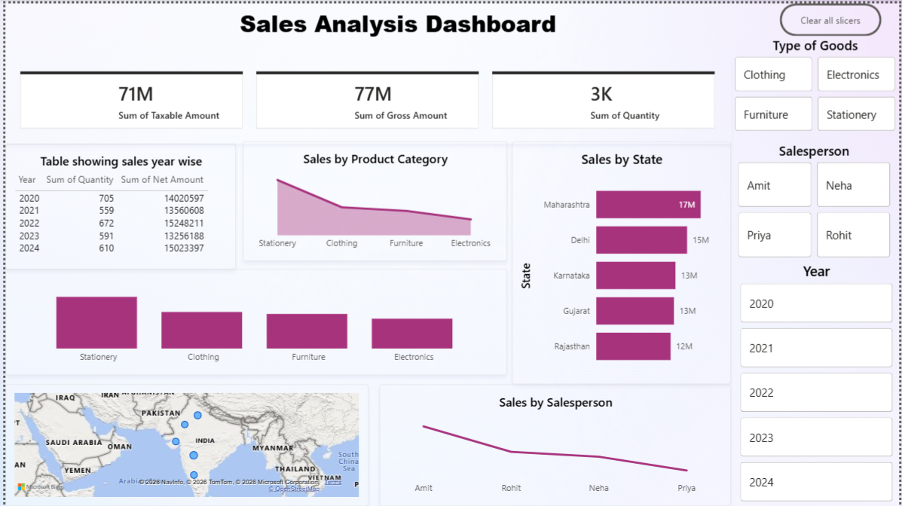

##  Sales Analysis Dashboard

---

###  Project Overview  
This project presents an interactive Sales Analysis Dashboard built using Power BI. It provides insights into sales performance across different categories, states, and salespersons.

---

###  Key Metrics  
-  Total Taxable Amount: 71M  
- Gross Amount: 77M  
- Quantity Sold: 3K  

---

### Insights  
-  Sales trend across years (2020–2024)  
-  Category-wise sales performance  
- State-wise sales distribution  
- Salesperson performance analysis  
- Geographic sales visualization  

---

### Key Highlights  
- Maharashtra leads in sales performance  
- Stationery category contributes highest sales  
- Sales show fluctuations over years  
- Individual salesperson performance varies significantly  

---

###  Tools Used  
- Power BI  
- DAX  
- Data Visualization  

---

### 📂 Project Structure  
- sales-dashboard.png  
- Sales Dashboard.pbix  
- README.md  
